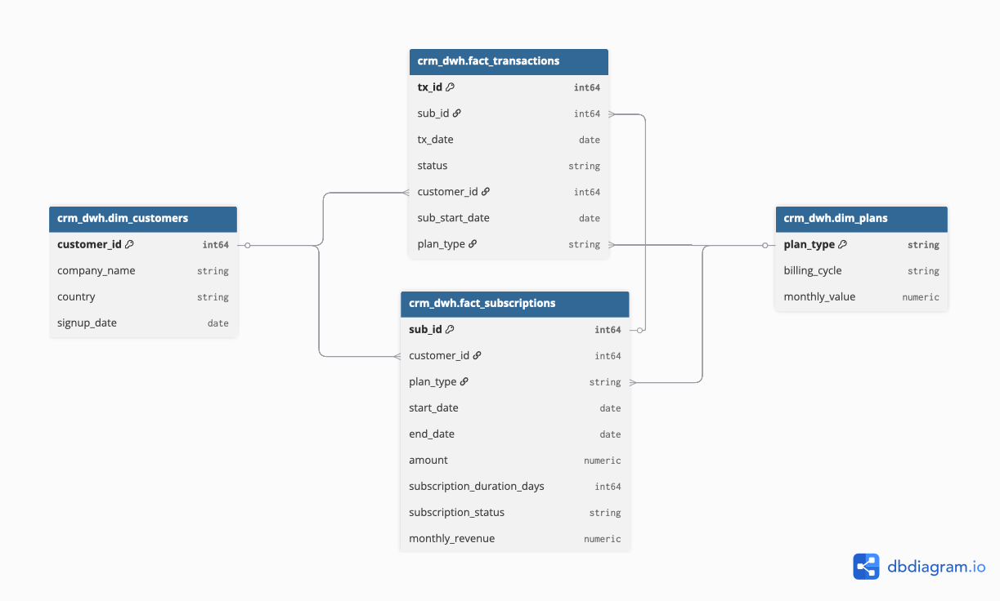
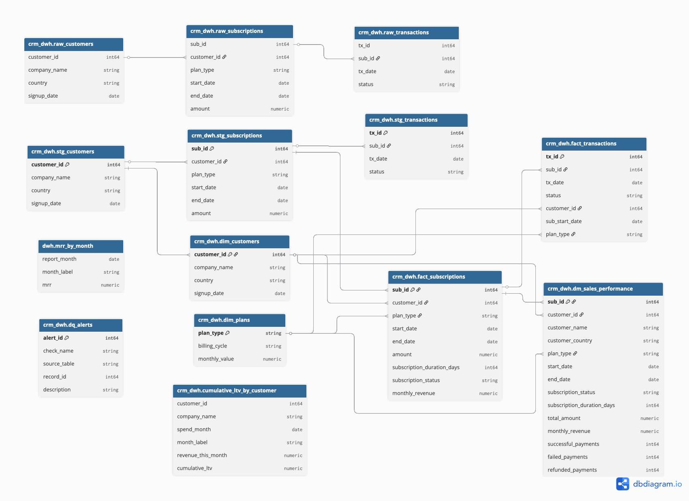
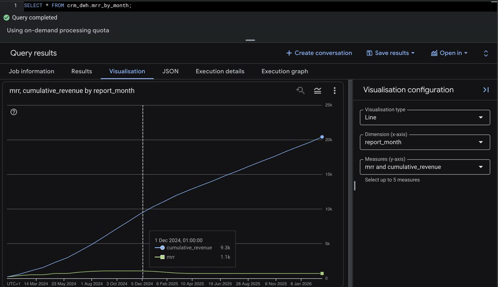
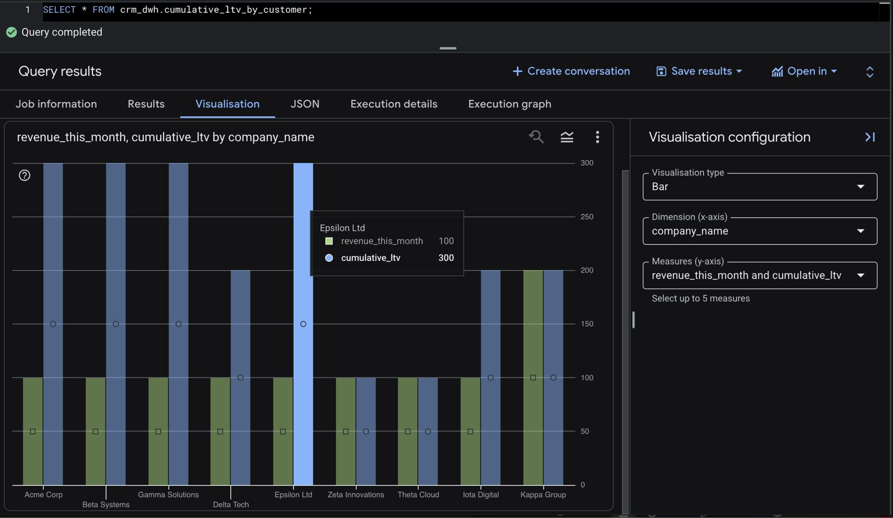

# JetBrains — CRM Sales Performance Analytics Assessment

A data engineering pipeline that ingests raw CRM subscription data, cleans it, models it into a dimensional warehouse, and exposes business-ready revenue analytics.

---

## What this project does
SaaS companies like JetBrains need to understand revenue trends across their customer base. This pipeline answers key business questions:

- **How much recurring revenue is the business generating each month (MRR)?**
- **How does each customer's lifetime value grow over time?**
- **Which subscriptions have successful vs failed vs refunded payments?**
- **Where is our CRM data dirty or inconsistent?**

The pipeline takes raw CRM exports, cleans them, organizes them into a star schema, and produces a data mart that any analyst or BI tool can query directly.

---

## Architecture
```
-------------------------------------------------------
│  SOURCE LAYER  (00_schema + 01_seed)                │
│                                                     │
│  Tables: raw_customers, raw_subscriptions,          │
│          raw_transactions                           │
│                                                     │
│  What it does:                                      │
│    - Stores the original CRM data as-is             │
│    - Never modified or deleted after load           │
│    - Acts as the single source of truth             │
-------------------------------------------------------
                        │
                        ▼
-------------------------------------------------------
│  STAGING LAYER  (02_staging)                        │
│                                                     │
│  Tables: stg_customers, stg_subscriptions,          │
│          stg_transactions                           │
│                                                     │
│  What it does:                                      │
│    - Removes invalid and incomplete records         │
│    - Deduplicates repeated transaction entries      │
│    - Validates statuses, plan types, and dates      │
│                                                     │
│  dq_alerts: logs every data quality issue found     │
│             without blocking the pipeline           │
-------------------------------------------------------
                        │
                        ▼
-------------------------------------------------------
│  DWH LAYER  (03_dwh)                                │
│                                                     │
│  Tables: dim_customers, dim_plans,                  │
│          fact_subscriptions, fact_transactions      │
│                                                     │
│  What it does:                                      │
│    - Organizes data into a star schema              │
│    - Separates descriptive attributes (dims)        │
│      from measurable events (facts)                 │
│    - Adds computed columns like                     │
│      subscription_duration_days, monthly_revenue,   │
│      and subscription_status                        │
-------------------------------------------------------
                        │
                        ▼
-------------------------------------------------------
│  DATA MART  (04_mart + 05_analytics)                │
│                                                     │
│  Tables: dm_sales_performance,                      │
│          mrr_by_month,                              │
│          cumulative_ltv_by_customer                 │
│                                                     │
│  What it does:                                      │
│    - Joins all layers into one business-ready table │
│    - One row per subscription with all metrics      │
│    - Exposes analytical views for direct querying   │
-------------------------------------------------------
```

---

## Star schema


---

## Database schema


---

## Data quality checks
Every pipeline run scans raw data and logs issues to `dq_alerts` without blocking the load:

| Check | What it catches |
|-------|----------------|
| `transaction_before_subscription_start` | Transaction date is earlier than subscription start date |
| `end_before_start` | Subscription end date is earlier than start date |
| `duplicate_transaction` | Same transaction slot entered more than once in CRM |

The staging layer also silently filters:

| Table | What gets filtered |
|-------|--------------------|
| `stg_customers` | Rows with NULL `customer_id` or NULL `company_name` |
| `stg_subscriptions` | Rows with NULL ids or invalid `plan_type` values |
| `stg_transactions` | Rows with invalid `status` values (e.g. 'Pending', 'Processing') |

## How to run

### Prerequisites
- Google account with access to [BigQuery console](https://console.cloud.google.com/bigquery)

### Setup steps

**1. Create the dataset**
In BigQuery console, create a dataset named `crm_dwh` in your project with any region.

**2. Run SQL files in order**
| Step | File | What it does |
|------|------|-------------|
| 1 | `00_schema.sql` | Creates raw tables |
| 2 | `01_seed.sql` | Loads sample data (13 customers, 18 subscriptions, 28 transactions) |
| 3 | `02_staging.sql` | Cleans data, flags DQ issues |
| 4 | `03_dwh.sql` | Builds star schema |
| 5 | `04_mart.sql` | Creates `dm_sales_performance` |
| 6 | `05_analytics.sql` | Creates MRR and LTV views |


## Analytical queries (Part B)

### MRR (Monthly Recurring Revenue)
Calculates revenue for each month. Annual plans ($1200) are divided by 12 and spread across every active month ($100/mo) using `GENERATE_DATE_ARRAY` + `UNNEST`. Only subscriptions with at least one successful payment are counted.

```sql
SELECT * FROM crm_dwh.mrr_by_month;
```


### Cumulative LTV by customer
Shows how each customer's total spend grows month by month from their first payment. Uses `SUM() OVER()` window function for the running total per customer.

```sql
SELECT * FROM crm_dwh.cumulative_ltv_by_customer;
```


---

---

## Key tables reference

| Table | Layer | Description |
|-------|-------|-------------|
| `raw_customers` | Source | Original customer records from CRM |
| `raw_subscriptions` | Source | Original subscription records from CRM |
| `raw_transactions` | Source | Original payment transaction records |
| `stg_customers` | Staging | Cleaned customers (10 valid rows) |
| `stg_subscriptions` | Staging | Cleaned subscriptions (15 valid rows) |
| `stg_transactions` | Staging | Deduplicated transactions (23 valid rows) |
| `dq_alerts` | Staging | All data quality issues found |
| `dim_customers` | DWH | Customer dimension |
| `dim_plans` | DWH | Plan type lookup (Monthly/Annual) with monthly value |
| `fact_subscriptions` | DWH | Subscription facts with computed metrics |
| `fact_transactions` | DWH | Payment transaction events |
| `dm_sales_performance` | Mart | One row per subscription, all metrics joined |
| `mrr_by_month` | Analytics | Monthly recurring revenue with cumulative total |
| `cumulative_ltv_by_customer` | Analytics | Running LTV per customer month by month |

---

## Design decisions

- **BigQuery**: serverless, no infrastructure to manage, free tier sufficient for this scale
- **Layered architecture**: raw → staging → DWH → mart mirrors production warehouse patterns
- **DQ alerts table**: surfaces data issues without blocking the pipeline
- **Star schema**: separates descriptive attributes (dims) from measurable events (facts)